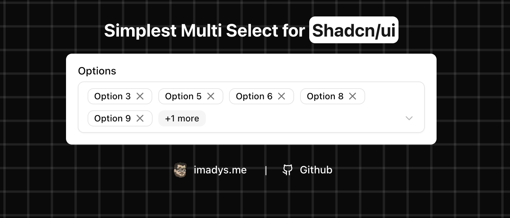

# Simple multi select for shadcn

A customizable multi-select dropdown built using Headless UI-style components. Ideal for selecting multiple options with visual feedback using badges.

---




## Installiaton

`npx shadcn@latest add badge select form`

Add this code to ui/components ( Remove the FormControl if you're not planning for using it with Form )
```tsx
"use client";

import { cn } from "@/lib/utils";
import { Check, X } from "lucide-react";
import { useState } from "react";

import { Badge } from "./badge";
import { FormControl } from "./form";
import {
    Select,
    SelectContent,
    SelectGroup,
    SelectTrigger,
    SelectValue,
} from "./select";

interface SelectOption {
    label: string;
    value: string;
}

interface SimpleSimpleMultiSelectProps {
    options: SelectOption[];
    onChange?: (selected: string[]) => void;
    defaultValues?: string[];
}

export default function SimpleMultiSelect({
    options,
    onChange,
    defaultValues = [],
}: SimpleSimpleMultiSelectProps) {
    const [selectedOptions, setSelectedOptions] = useState<string[]>(defaultValues);

    const toggleOption = (value: string) => {
        const updatedSelection = selectedOptions.includes(value)
            ? selectedOptions.filter((item) => item !== value)
            : [...selectedOptions, value];

        setSelectedOptions(updatedSelection);
        onChange?.(updatedSelection);
    };

    return (
        <Select>
            <FormControl>
                <SelectTrigger className="w-full flex flex-wrap justify-start gap-2 [&>.lucide-chevron-down]:ms-auto">
                    {selectedOptions.length > 0 ? (
                        <>
                            {options
                                .filter((option) => selectedOptions.includes(option.value))
                                .slice(0, 5)
                                .map((option) => (
                                    <Badge key={option.value}>
                                        {option.label}
                                        <X
                                            onClick={(e) => {
                                                e.stopPropagation();
                                                toggleOption(option.value);
                                            }}
                                            className="w-3 h-3 ml-1 cursor-pointer"
                                        />
                                    </Badge>
                                ))}
                            {selectedOptions.length > 5 && (
                                <Badge variant="secondary">
                                    +{selectedOptions.length - 5} more
                                </Badge>
                            )}
                        </>
                    ) : (
                        <SelectValue placeholder="Select options" />
                    )}
                </SelectTrigger>
            </FormControl>
            <SelectContent>
                <SelectGroup>
                    {options.map((option) => {
                        const isSelected = selectedOptions.includes(option.value);
                        return (
                            <div
                                key={option.value}
                                className={cn(
                                    "relative flex items-center cursor-pointer py-1.5 pl-8 pr-2 text-sm rounded-sm hover:bg-accent",
                                    isSelected && "bg-accent/50"
                                )}
                                onClick={() => toggleOption(option.value)}
                            >
                                <span className="absolute left-2 flex items-center justify-center h-3.5 w-3.5">
                                    {isSelected && <Check className="w-4 h-4" />}
                                </span>
                                {option.label}
                            </div>
                        );
                    })}
                </SelectGroup>
            </SelectContent>
        </Select>
    );
}


```

## 📦 Import

| Prop           | Type                                   | Required | Description                                                  |
|----------------|----------------------------------------|----------|--------------------------------------------------------------|
| `options`      | `{ label: string, value: string }[]`   | ✅       | Array of selectable items to be rendered in the dropdown     |
| `onChange`     | `(selected: string[]) => void`         | ❌       | Callback fired when the selected items change                |
| `defaultValues`| `string[]`                             | ❌       | List of values to be selected initially                      |

----

## Usage
```tsx
import SimpleMultiSelect from "@/components/ui/simple-multi-select";

const options = [
  { label: "JavaScript", value: "js" },
  { label: "TypeScript", value: "ts" },
  { label: "Python", value: "python" },
  { label: "Go", value: "go" },
  { label: "Rust", value: "rust" },
];

function MyComponent() {
  const handleSelectionChange = (selectedValues: string[]) => {
    console.log("Selected values:", selectedValues);
  };

  return (
    <SimpleMultiSelect
      options={options}
      defaultValues={["js", "ts"]}
      onChange={handleSelectionChange}
    />
  );
}
